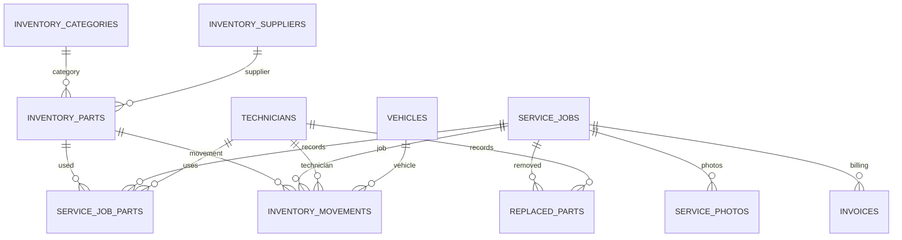

# Inventory & Spare Parts Management Module

## Firestore Collections

- `inventoryParts`
- `inventoryCategories`
- `inventorySuppliers`
- `inventoryMovements`
- `serviceJobParts`
- `replacedParts`
- `servicePhotos`
- `notifications`

Stock updates for part usage and returns are performed inside Firestore transactions to prevent negative stock and keep movement logs in sync.

## ER Diagram

## Firestore Setup Order

1. Run `npm run firebase:provision`.
2. Run `npm run firebase:seed-system`.
3. Run `npm run firebase:check-system`.

## Reports

- Inventory report
- Low-stock report
- Stock movement report
- Technician usage report
- Vehicle parts report
- Monthly usage report
- Inventory value report

## API Coverage

- Admin inventory item create/update/delete
- Admin supplier create/update
- Admin inventory reports
- Technician inventory search/read
- Technician part usage
- Technician part return
- Technician parts request
- Technician replaced parts
- Customer used parts and service photos through customer dashboard
