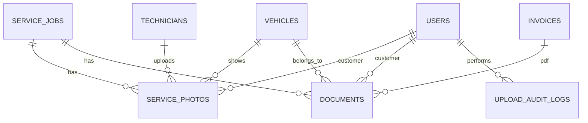

# Photo & Document Management Module

## Storage

Files are uploaded as base64 payloads to authenticated API endpoints, validated server-side, stored under `uploads/service-files`, and exposed only through authenticated download routes.

Allowed formats: `JPG`, `PNG`, `PDF`, `DOCX`

Maximum file size: `5MB`

## Firestore Collections

- `servicePhotos`
- `documents`
- `uploadAuditLogs`
- `serviceJobs`
- `vehicles`
- `technicians`
- `invoices`

## Permissions

- Admin can upload, view, download, and permanently delete files.
- Assigned technicians can upload service-job photos/documents.
- Customers can only view/download files linked to their own service jobs.
- All uploads must be linked to a service job.
- Duplicate file uploads for the same service job and type are rejected.

## ER Diagram

## Migration Order

1. `database/schema.sql`
2. `database/technician-module.sql`
3. `database/inventory-module.sql`
4. `database/photo-document-module.sql`

## APIs

- `POST /api/technician/jobs/:id/photos/upload`
- `POST /api/technician/jobs/:id/documents/upload`
- `POST /api/admin/service-jobs/:id/photos/upload`
- `POST /api/admin/service-jobs/:id/documents/upload`
- `GET /api/files/:kind/:id/download`
- `DELETE /api/admin/files/:kind/:id`
- `GET /api/invoices/:id/pdf`
- `POST /api/invoices/:id/email`
