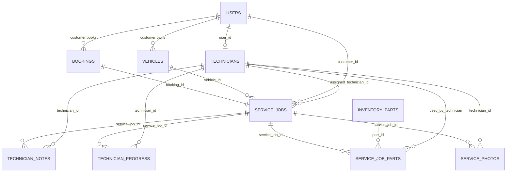

# Technician Management Module

## Firestore Collections

The running application stores the module in Firestore through the Express repository layer:

- `users` with `role = technician`
- `technicians`
- `serviceJobs`
- `technicianNotes`
- `technicianProgress`
- `serviceJobParts`
- `inventoryParts`
- `servicePhotos`
- `notifications`

Firestore does not enforce foreign keys natively. The API layer enforces ownership, assignment, stock, duplicate-job, duplicate-assignment, completion, and billing rules before each write.

## ER Diagram

## Firestore Setup Order

1. Run `npm run firebase:provision`.
2. Run `npm run firebase:seed-system`.
3. Run `npm run firebase:check-system`.

## Workflow

1. Customer books service.
2. Admin approves booking.
3. Admin creates a service job from the booking.
4. Admin assigns or reassigns an active technician.
5. Technician views assigned jobs only.
6. Technician updates progress, notes, images, and parts used.
7. Technician can complete a job only after progress reaches `100`.
8. Admin and customer receive notifications on key changes.
9. Billing is allowed only for completed service jobs.
